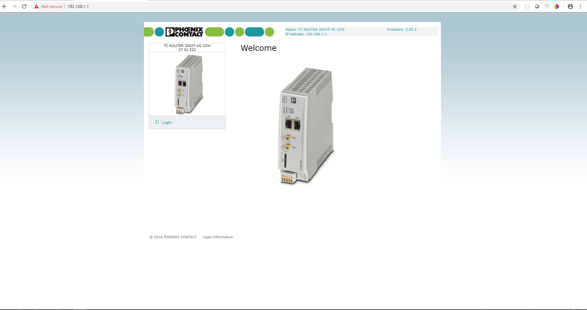

# Setup Overview

This package requires configuration of the TC Router device.  The first step is to enable the 'Socket Server' functionality.  After which, extended functionalities can be configured on an as needed basis.  The following pages direct the user through each of these configuration steps and options.

### Connecting to the Web Based Management

In order to configure the device, you'll need to establish a connection to the device's web page.  Type in https://\[ip address of the device\]

### Logging In

The default user name and password are 'admin' and 'private' respectively.  For security purposes, these should be changed after the first login.

